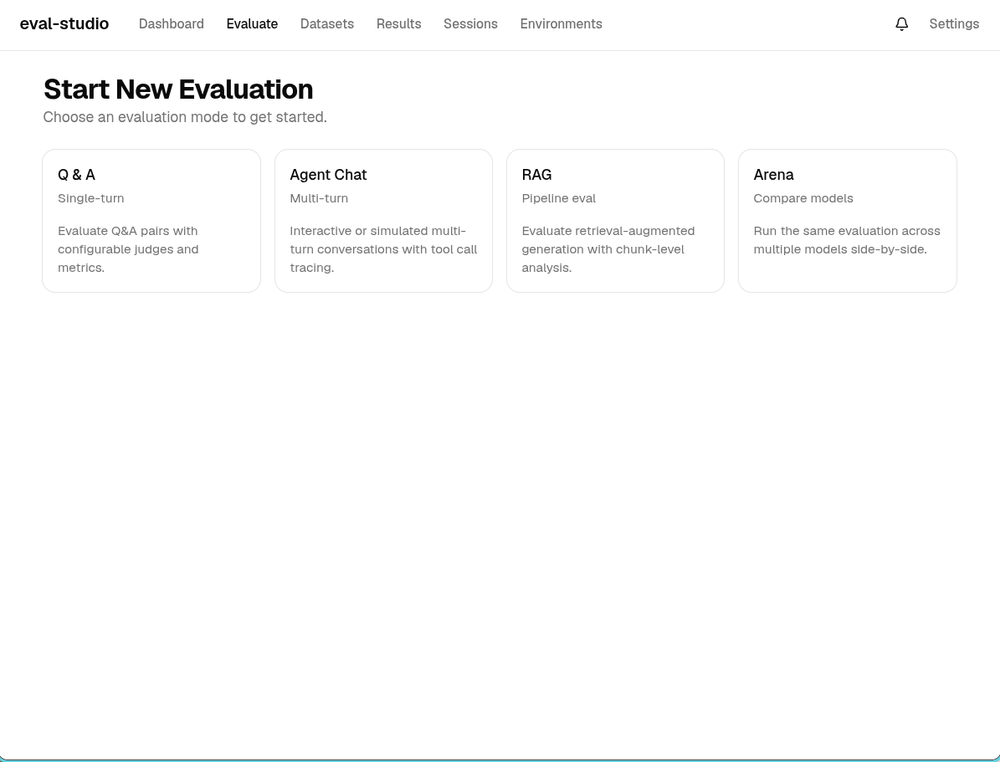
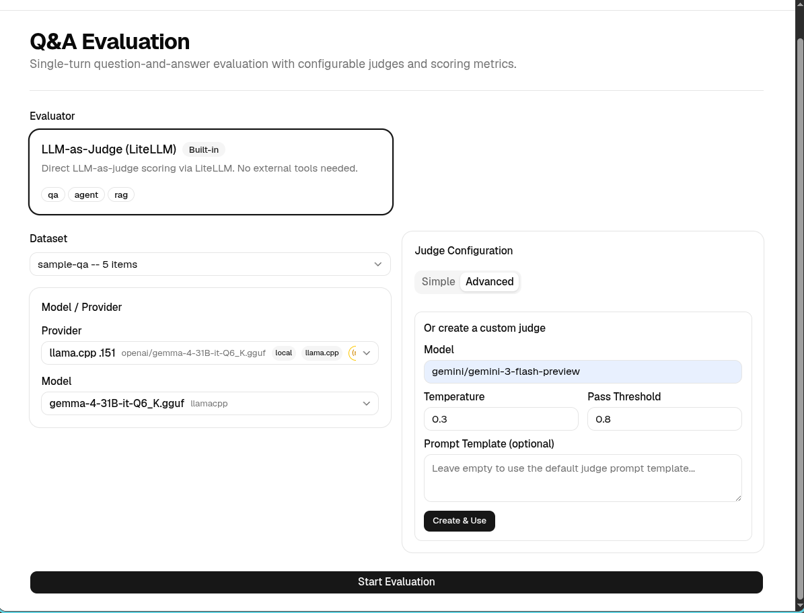
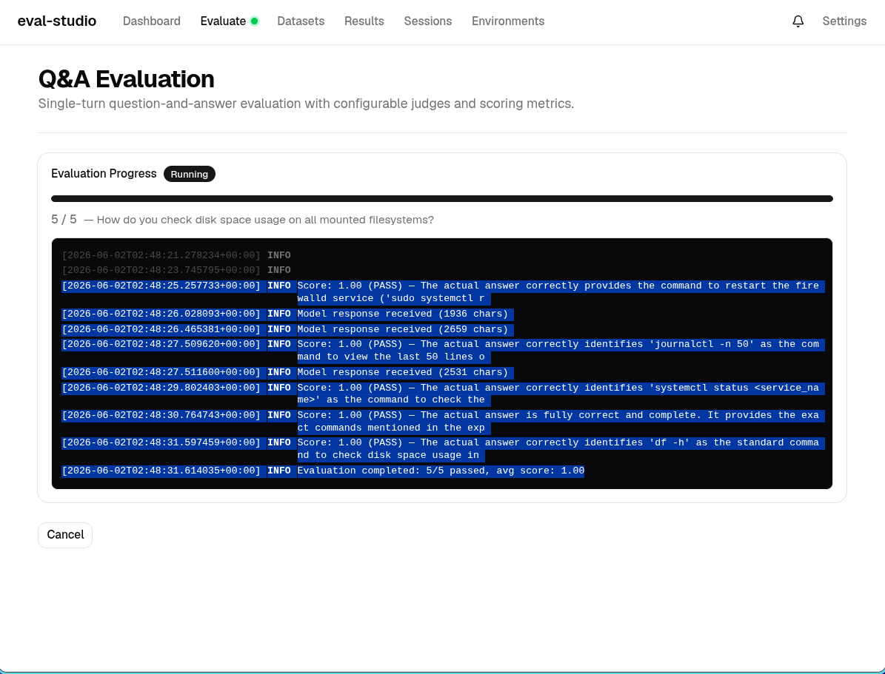
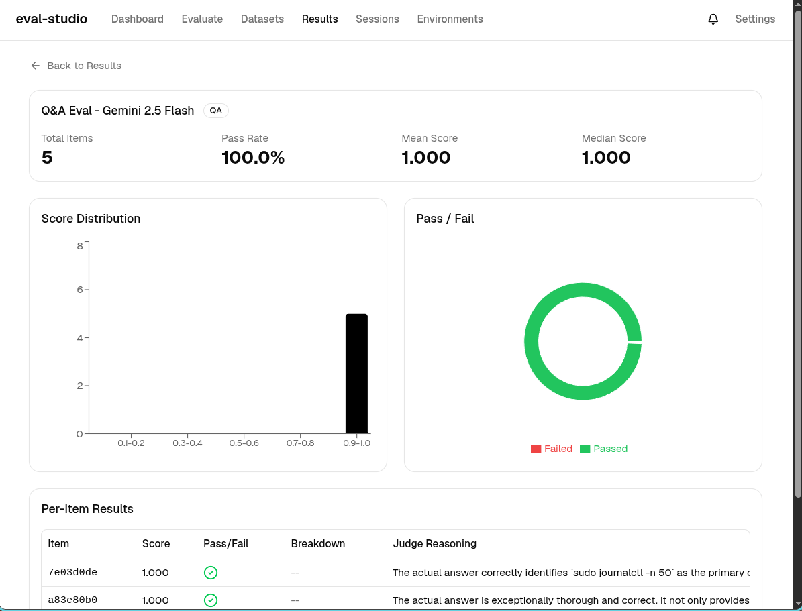
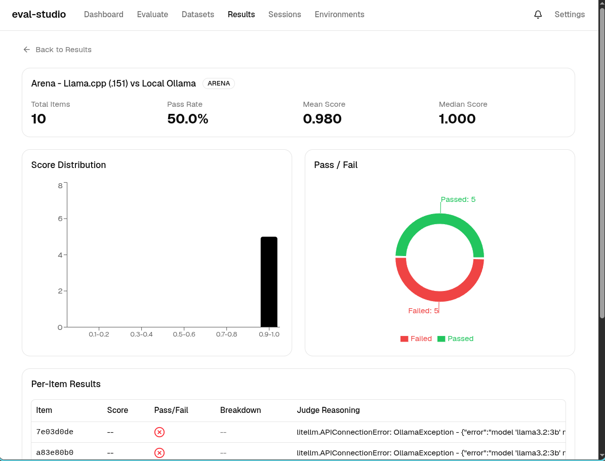
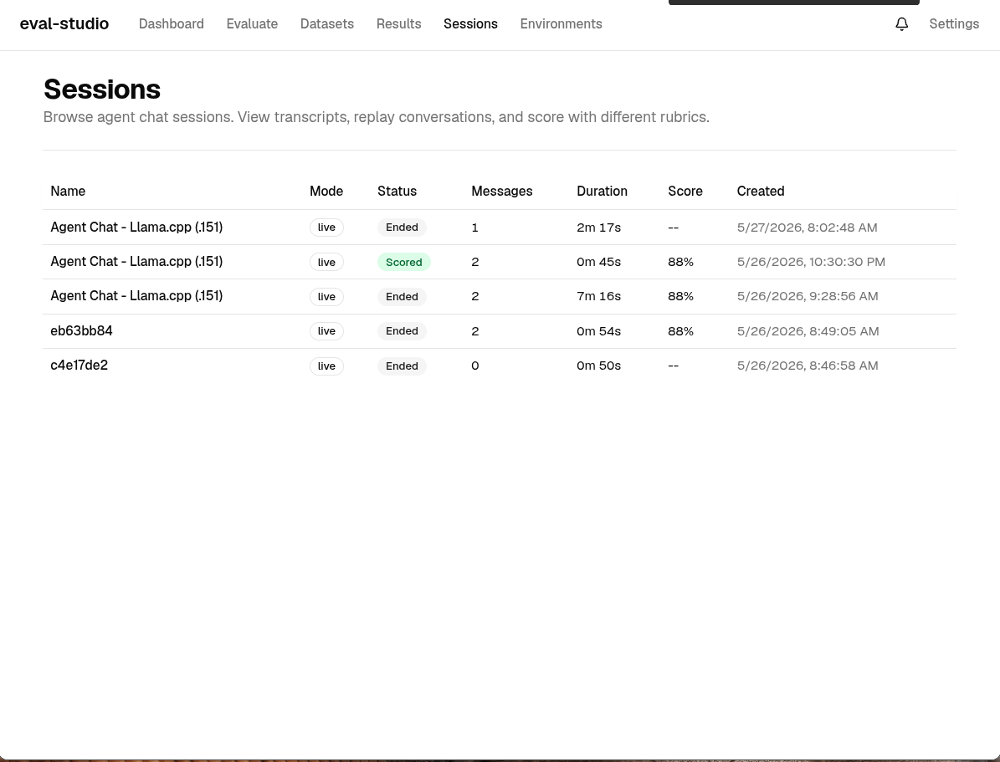
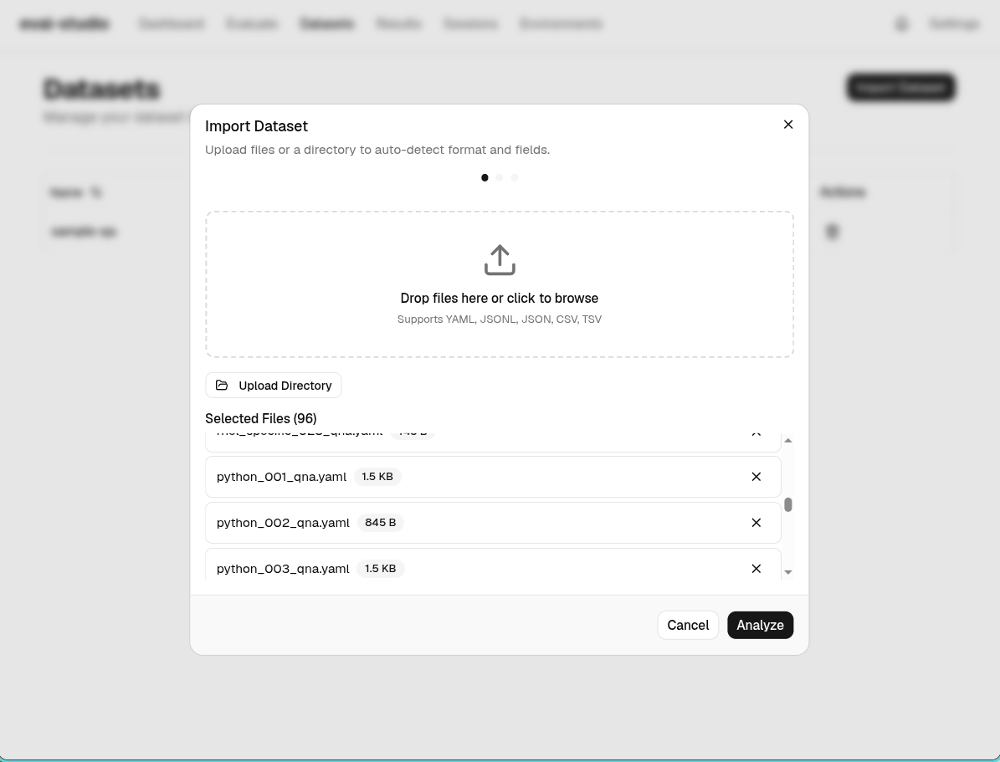
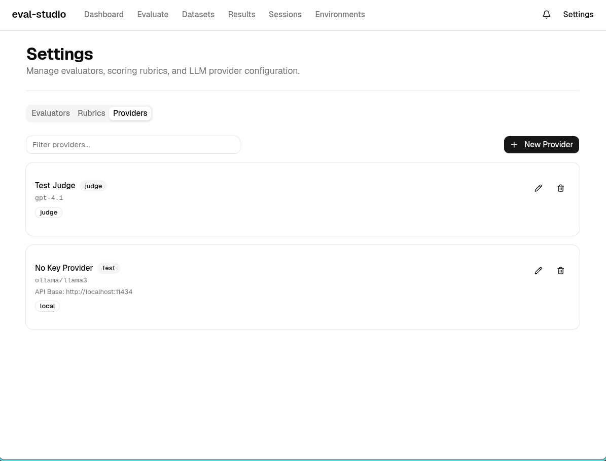

# eval-studio

The workspace for building, running, and improving AI evaluations — designed for engineers and subject-matter experts alike.

## Overview

eval-studio goes beyond running AI evaluations. It is a complete workspace for building everything needed to evaluate AI systems successfully: datasets, scoring metrics, evaluation rubrics, and telemetry integrations — then using them seamlessly with any evaluation framework onboarded into the platform.

Whether you're iterating on a chatbot's response quality, validating a RAG pipeline, benchmarking model candidates, or scoring autonomous agents, eval-studio provides the tools to design evaluations, execute them at scale, and refine them with AI-assisted feedback — all from a single interactive UI accessible to both engineers and non-technical SMEs.

### What you can do

- **Build datasets** — Import from any format (YAML, JSONL, JSON, CSV), auto-detect fields, map to eval-studio's schema, upload directories of files. Smart import handles lightspeed-evaluation, SQuAD, Alpaca, and custom formats.
- **Design scoring rubrics** — Create evaluation dimensions with AI assistance via rubric-kit. Generate rubrics from natural language, refine with feedback, compare scoring approaches.
- **Configure LLM providers** — Register any model endpoint (OpenAI-compatible, LiteLLM-backed). Manage API keys via environment variables, never stored directly.
- **Run evaluations** — Q&A benchmarks, RAG pipelines, interactive agent sessions, or side-by-side model arena. Live logs and progress streamed via WebSocket.
- **Compare and iterate** — Arena mode for head-to-head model comparison with visual leaderboards. Per-question drill-down across contestants.
- **Plug in any evaluation framework** — Adapter architecture supports onboarding external evaluation systems. lightspeed-evaluation is the first target integration.

### Evaluation modes

| Mode | What it does |
|------|-------------|
| **Q&A Evaluation** | Run datasets against models with LLM-as-judge scoring |
| **RAG Evaluation** | Evaluate retrieval + generation with faithfulness and relevance metrics |
| **Agent Chat** | Live multi-turn conversations with tool-call observation and scoring |
| **Model Arena** | Same evaluation across multiple models side-by-side with leaderboard |

## Screenshots

### Choose your evaluation mode



### Configure and launch a Q&A evaluation



### Watch evaluation progress in real time



### Review results with score distributions and per-item drill-down



### Compare models head-to-head in Arena mode



### Browse agent chat sessions



### Import datasets from any format



### Manage providers, evaluators, and rubrics



## Tech Stack

- **Frontend**: React 19 + TypeScript, Vite, shadcn/ui + Tailwind CSS, Zustand
- **Backend**: FastAPI (Python 3.11+), SQLAlchemy 2.0, SQLite (MVP)
- **LLM Access**: LiteLLM proxy (100+ providers)
- **Evaluation Design**: rubric-kit for AI-assisted rubric generation and refinement

## Security Model

eval-studio is a **single-trust-domain tool** — everyone who can reach the
API/UI is fully trusted. The backend makes server-side HTTP requests to
user-configured endpoints by design; do not expose it beyond your trusted
network. See [Getting Started — Security Model](docs/docs/getting-started.md)
for details and authentication options.

## Development

```bash
# Backend
cd backend && uv sync && uv run uvicorn app.main:app --reload --port 8000

# Frontend
cd frontend && npm install && npm run dev

# Or via Make
make dev
```

## License

Apache 2.0
