# Issue Relationship Graph

94 issues. Hard edges only (`depends_on`, `supersedes`, `conflicts_with`); `related` edges are listed per-issue in frontmatter and omitted here for legibility.

Validation: `python3 review/99-synthesis/check_graph.py` (checks frontmatter parse, dangling refs, edge symmetry, depends_on cycles). **Executed at the end of the review session** (after the classifier outage lifted) — clean output, pasted verbatim:

```
issues: 94
hard edges (depends_on/supersedes/conflicts_with, directed): 27
superseded (graph-record) issues: 11: API-003, BUG-006, BUG-008, CONS-007, DOC-003, DOC-004, DUP-003, DUP-004, FE-005, FE-006, SIMP-005
graph OK: no dangling refs, symmetric edges, no depends_on cycles
```
*(Initially 92 issues; INFRA-007 and INFRA-008 were added after toolchain execution became possible and surfaced two red-on-main findings; the output above is from the final run.)*

(The same edge set was independently audited by hand via a grep dump of all frontmatter relationship fields; both methods agree. Re-run the script whenever issue files are edited.)

## Diagram — supersession & dependency clusters

```mermaid
graph TD
  subgraph consolidations["Structural decisions (Phase 1)"]
    ARCH001[ARCH-001 eval runner]
    ARCH002[ARCH-002 provider store]
    ARCH003[ARCH-003 WS protocol]
    ARCH004[ARCH-004 type codegen]
    ARCH006[ARCH-006 session end]
    SIMP001[SIMP-001 delete environments]
    SIMP002[SIMP-002 delete evaluator machinery]
    SIMP004[SIMP-004 delete clients/]
    SIMP007[SIMP-007 delete judge examples]
    INFRA002[INFRA-002 startup migrations]
  end

  ARCH001 -- supersedes --> DUP003[DUP-003]
  ARCH001 -- supersedes --> DUP004[DUP-004]
  ARCH002 -- supersedes --> CONS007[CONS-007]
  ARCH003 -- supersedes --> FE006[FE-006]
  ARCH004 -- supersedes --> API003[API-003]
  ARCH006 -- supersedes --> BUG008[BUG-008]
  SIMP001 -- supersedes --> FE005[FE-005]
  SIMP001 -- supersedes --> DOC003[DOC-003]
  SIMP002 -- supersedes --> SIMP005[SIMP-005]
  SIMP007 -- supersedes --> DOC004[DOC-004]
  INFRA002 -- supersedes --> BUG006[BUG-006]

  DUP010[DUP-010 provider shapes] -- depends_on --> ARCH002
  DATA006[DATA-006 migration squash] -- depends_on --> ARCH002
  TEST002[TEST-002 dead-code tests] -- depends_on --> ARCH002
  TEST002 -- depends_on --> SIMP002
  TEST002 -- depends_on --> SIMP003[SIMP-003 BuiltinHarness]
  API002[API-002 WS drift] -- depends_on --> ARCH003
  TEST003[TEST-003 coverage gaps] -- depends_on --> ARCH001
  TEST003 -- depends_on --> ARCH003
  TEST003 -- depends_on --> INFRA001[INFRA-001 static serving]
  TEST003 -- depends_on --> INFRA002
  DOC002[DOC-002 setup docs] -- depends_on --> INFRA002
  FE002[FE-002 cancel button] -- depends_on --> API004[API-004 cancelled status]

  SIMP002 <-. conflicts .-> BUG018[BUG-018 wire evaluator_id]
  SIMP004 <-. conflicts .-> INFRA005[INFRA-005 clients in CI]
```



## Cascade table

For every issue that supersedes or blocks ≥2 others — the full downstream consequence of implementing it:

| Implementing… | Closes without action | Re-scopes / unblocks | Notes |
|---|---|---|---|
| **ARCH-001** (single eval runner) | DUP-003, DUP-004 | Unblocks TEST-003 (lifecycle contract test). Relocates the fix sites of BUG-001, BUG-009, BUG-010, BUG-012, BUG-015, BUG-016, PERF-001, PERF-004, BUG-018/SIMP-002 (adapter construction becomes 1 site), CONS-002 (many literals rewritten), DUP-012 (same file) | Largest single de-duplication; do early |
| **ARCH-002** (single provider store) | CONS-007 | Unblocks DUP-010 (shape collapse), DATA-006 (squash), TEST-002 tranche 1 (delete `test_provider_model.py`). Removes step 1 of ARCH-008 (the providers UPDATE) | Pure deletion; near-zero risk |
| **ARCH-003** (WS protocol ownership) | FE-006 | Unblocks API-002 (drift checklist) and TEST-003 item 3 (conformance test). Makes ARCH-007 step 6 trivial | Breaking only on the wire, no external consumers |
| **ARCH-004** (type codegen) | API-003 | Surfaces API-001/API-004 as type errors; determines INFRA-005's models strategy if clients/ survives | |
| **ARCH-006** (single session end) | BUG-008 | Precondition (practically) for FE-003's REST-only variant | |
| **SIMP-001** (delete environments) | FE-005, DOC-003 | Removes `environment_id` from DATA-001's scope; enables asyncssh removal (SIMP-006); shrinks DOC-001 rewrite | ≈900 lines + 4 dirs deleted |
| **SIMP-002** (delete evaluator machinery) | SIMP-005 | Unblocks TEST-002 tranche 2; closes the BUG-018 conflict in the delete direction; shrinks DOC-001 | Mutually exclusive with BUG-018 |
| **INFRA-002** (startup migrations) | BUG-006 | Unblocks DOC-002 (setup docs) and TEST-003 item 1 (boot test); pairs with ARCH-008 (its data migration rides the same hook) | With INFRA-001, makes the prod image actually work |
| **SIMP-007** (delete judge examples) | DOC-004 | — | Quick win |
| **API-004** (cancellation decision) | — | Unblocks FE-002 (button behavior); feeds CONS-002 (enum truth) | Decision point: option A (implement) locked by TARGET-ARCHITECTURE |

## Conflict pairs and recommended resolutions

| Conflict | Options | Recommendation | Why |
|---|---|---|---|
| **SIMP-002 ⟷ BUG-018** | delete evaluator machinery vs wire `evaluator_id` dispatch | **SIMP-002** | One adapter exists; no in-repo evidence of a second integration in progress; a dict-factory is a one-day re-add when lightspeed-evaluation actually lands. If the owner confirms that integration is scheduled within the next phase or two, invert: implement BUG-018 and keep TEST-002's evaluator tests with added dispatch assertions. |
| **SIMP-004 ⟷ INFRA-005** | delete clients/ vs add it to CI | **SIMP-004** | The documented CI use case is covered by `POST /evaluations/run` with `Accept: text/plain`; an untested 2,500-line mirror is pure liability. If a real SDK consumer exists, invert: INFRA-005 + regenerate models per ARCH-004. |

## Reading the graph when implementing incrementally

- Before picking up any issue, check its `superseded_by`: if a listed issue has been implemented, close it unread.
- Before implementing a superseding issue, skim its children's Evidence sections — they enumerate the concrete defects the consolidation must demonstrably fix (they double as its acceptance criteria).
- `related` edges flag same-file overlap: batch those into one PR to avoid conflicts (e.g. BUG-005+BUG-017; BUG-011+BUG-013+DUP-006; BUG-015+PERF-004; DUP-009+CONS-004).
